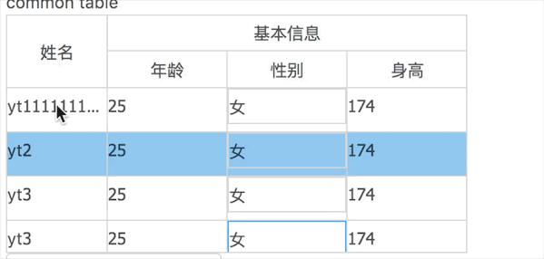

l am a table component;

  

[online website](https://yt1520406335.github.io/yt-table-home/)

## usage


```
npm install yt-table --save

//or 

yarn add yt-table

```

### code
```
<Table
    // old had abandon
    // rowKey={record => record.id}
    getRowKey={record => record.id}
    dataSource={dataSource}
    columns={columns}
    onCellChange={this.handleCellChange}
/>
```

### examples

```
git clone https://github.com/yt1520406335/yt-table.git

cd examples/test/

yarn install
// or
npm install

// l use 'parcel' as Packaging tools

parcel index.html

open http://localhost:1234
```

### feature
#### you can use tab to switch focus 

column set type 'input',

#### fatherTitle

```
{
    title: 'sex',
    key: 'sex',
    type: 'select',
    fatherTitle: {
        title: 'base info',
    },
    canFocus: true,
},
{
    title: 'height',
    key: 'height',
    type: 'input',
    fatherTitle: {
        title: 'base info',
    },
    canFocus: true,
},
```

#### dragheader

you can use set ```draggable={true}``` or just ```draggable``` for
drag and drop to table cell size

### Reference resources
- [react-data-grid](https://github.com/adazzle/react-data-grid)

### issue
tab切换到下一个输入框  
作为组件 在document监听事件 感觉不太好啊